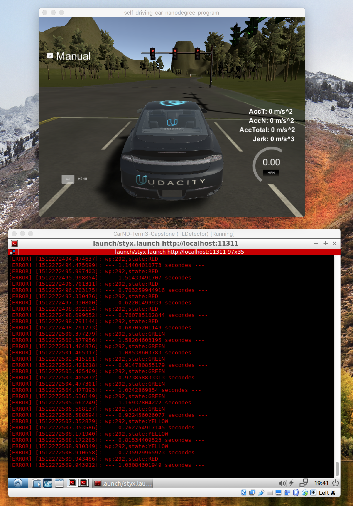

# TensorFlow Object Detection API Tutorial for Traffic Light Detection(TLD)

## 1. Set your environment

https://github.com/tensorflow/models/blob/master/research/object_detection/g3doc/installation.md

```
git clone https://github.com/tensorflow/models.git 
```

```
# From tensorflow/models
vi research/object_detection/g3doc/installation.md
```

```
export PYTHONPATH=$PYTHONPATH:`pwd`:`pwd`/slim 
```

```
# For CPU
pip install tensorflow
```

```
sudo pip install pillow
sudo pip install lxml
sudo pip install jupyter
sudo pip install matplotlib
```

```
# From tensorflow/models/research/
protoc object_detection/protos/*.proto --python_out=.
```

```
python object_detection/builders/model_builder_test.py
```

## 2. Test a Model

- Save images to models/research/object_detection

- Open models/research/objection_detection/**object_detection_tutorial.ipynb**

- Edit TEST_IMAGE_PATHS

```
TEST_IMAGE_PATHS = [ os.path.join(PATH_TO_TEST_IMAGES_DIR, 'image{}.jpg'.format(i)) for i in range(1, N+1) ]
```

- Here is my result: [A result of the jupyter notebook](research/object_detection/object_detection_tutorial.html)


## 3. Prepare train images

- [Using_your_own_dataset.md](https://github.com/tensorflow/models/blob/f20630e974b9ef0d44f45067360c7180db455f22/research/object_detection/g3doc/using_your_own_dataset.md)

- Sample .yaml

```
- annotations:
  - {class: Green, x_width: 52.65248226950354, xmin: 130.4964539007092, y_height: 119.60283687943263,
    ymin: 289.36170212765956}
  - {class: Green, x_width: 50.156028368794296, xmin: 375.60283687943263, y_height: 121.87234042553195,
    ymin: 293.90070921985813}
  - {class: Green, x_width: 53.33333333333326, xmin: 623.6595744680851, y_height: 119.82978723404256,
    ymin: 297.7588652482269}
  class: image
  filename: sim_data_capture/left0003.jpg
...
```

- Make TFRecord files


```
# From models/research/object_detection
mkdir training
python tf_record_sim.py --output_path training/training_sim.record
python tf_record_real.py --output_path training/training_real.record
```

## 4. Training the Model
- Preparing models
```
cd training
mkdir data
cp ./ ./data
mkdir configs
cp ../samples/configs/* ./configs
mkdir models & cd models
# models/research/object_detection/g3doc/detection_model_zoo.md
# download
wget http://download.tensorflow.org/models/object_detection/ssd_mobilenet_v1_coco_2017_11_17.tar.gz
wget http://download.tensorflow.org/models/object_detection/ssd_inception_v2_coco_2017_11_17.tar.gz
wget http://download.tensorflow.org/models/object_detection/faster_rcnn_inception_v2_coco_2017_11_08.tar.gz
wget http://download.tensorflow.org/models/object_detection/faster_rcnn_resnet50_coco_2017_11_08.tar.gz
# gunzip
gunzip ssd_mobilenet_v1_coco_2017_11_17.tar.gz
gunzip ssd_inception_v2_coco_2017_11_17.tar.gz
gunzip faster_rcnn_resnet50_coco_2017_11_08.tar.gz
gunzip faster_rcnn_inception_v2_coco_2017_11_08.tar.gz
# un-tar
tar -xvf ssd_mobilenet_v1_coco_2017_11_17.tar
tar -xvf faster_rcnn_inception_v2_coco_2017_11_08.tar
tar -xvf faster_rcnn_resnet50_coco_2017_11_08.tar
tar -xvf ssd_inception_v2_coco_2017_11_17.tar
# copy .pb files
cp faster_rcnn_inception_v2_coco_2017_11_08/*.pb models/faster_rcnn_inception_v2_coco.pb
cp faster_rcnn_resnet50_coco_2017_11_08/*.pb models/faster_rcnn_resnet50_coco.pb
cp ssd_inception_v2_coco_2017_11_17/*.pb models/ssd_inception_v2_coco.pb
cp ssd_mobilenet_v1_coco_2017_11_17/*.pb models/ssd_mobilenet_v1_coco.pb
# copy .ckpt files
cp faster_rcnn_inception_v2_coco_2017_11_08/model.ckpt.data-00000-of-00001 models/faster_rcnn_inception_v2_coco.ckpt.data-00000-of-00001
cp faster_rcnn_resnet50_coco_2017_11_08/model.ckpt.data-00000-of-00001 models/faster_rcnn_resnet50_coco.ckpt.data-00000-of-00001
cp ssd_inception_v2_coco_2017_11_17/model.ckpt.data-00000-of-00001 models/ssd_inception_v2_coco.ckpt.data-00000-of-00001
cp ssd_mobilenet_v1_coco_2017_11_17/model.ckpt.data-00000-of-00001 models/ssd_mobilenet_v1_coco.ckpt.data-00000-of-00001

cp faster_rcnn_inception_v2_coco_2017_11_08/model.ckpt.index models/faster_rcnn_inception_v2_coco.ckpt.index
cp faster_rcnn_resnet50_coco_2017_11_08/model.ckpt.index models/faster_rcnn_resnet50_coco.ckpt.index
cp ssd_inception_v2_coco_2017_11_17/model.ckpt.index models/ssd_inception_v2_coco.ckpt.index
cp ssd_mobilenet_v1_coco_2017_11_17/model.ckpt.index models/ssd_mobilenet_v1_coco.ckpt.index

cp faster_rcnn_inception_v2_coco_2017_11_08/model.ckpt.meta models/faster_rcnn_inception_v2_coco.ckpt.meta
cp faster_rcnn_resnet50_coco_2017_11_08/model.ckpt.meta models/faster_rcnn_resnet50_coco.ckpt.meta
cp ssd_inception_v2_coco_2017_11_17/model.ckpt.meta models/ssd_inception_v2_coco.ckpt.meta
cp ssd_mobilenet_v1_coco_2017_11_17/model.ckpt.meta models/ssd_mobilenet_v1_coco.ckpt.meta
# rm model dirs
rm -rf faster_rcnn_inception_v2_coco_2017_11_08
rm -rf faster_rcnn_resnet50_coco_2017_11_08
rm -rf ssd_inception_v2_coco_2017_11_17
rm -rf ssd_mobilenet_v1_coco_2017_11_17
```

| Model name                               | Speed (ms) | COCO mAP[^1] | Outputs |
| ---------------------------------------- | ---------- | ------------ | ------- |
| [ssd_mobilenet_v1_coco](http://download.tensorflow.org/models/object_detection/ssd_mobilenet_v1_coco_2017_11_17.tar.gz) | 30         | 21           | Boxes   |
| [ssd_inception_v2_coco](http://download.tensorflow.org/models/object_detection/ssd_inception_v2_coco_2017_11_17.tar.gz) | 42         | 24           | Boxes   |
| [faster_rcnn_inception_v2_coco](http://download.tensorflow.org/models/object_detection/faster_rcnn_inception_v2_coco_2017_11_08.tar.gz) | 58         | 28           | Boxes   |
| [faster_rcnn_resnet50_coco](http://download.tensorflow.org/models/object_detection/faster_rcnn_resnet50_coco_2017_11_08.tar.gz) | 89         | 30           | Boxes   |
| [faster_rcnn_resnet50_lowproposals_coco](http://download.tensorflow.org/models/object_detection/faster_rcnn_resnet50_lowproposals_coco_2017_11_08.tar.gz) | 64         |              | Boxes   |
| [rfcn_resnet101_coco](http://download.tensorflow.org/models/object_detection/rfcn_resnet101_coco_2017_11_08.tar.gz) | 92         | 30           | Boxes   |
| [faster_rcnn_resnet101_coco](http://download.tensorflow.org/models/object_detection/faster_rcnn_resnet101_coco_2017_11_08.tar.gz) | 106        | 32           | Boxes   |
| [faster_rcnn_resnet101_lowproposals_coco](http://download.tensorflow.org/models/object_detection/faster_rcnn_resnet101_lowproposals_coco_2017_11_08.tar.gz) | 82         |              | Boxes   |
| [faster_rcnn_inception_resnet_v2_atrous_coco](http://download.tensorflow.org/models/object_detection/faster_rcnn_inception_resnet_v2_atrous_coco_2017_11_08.tar.gz) | 620        | 37           | Boxes   |
| [faster_rcnn_inception_resnet_v2_atrous_lowproposals_coco](http://download.tensorflow.org/models/object_detection/faster_rcnn_inception_resnet_v2_atrous_lowproposals_coco_2017_11_08.tar.gz) | 241        |              | Boxes   |
| [faster_rcnn_nas](http://download.tensorflow.org/models/object_detection/faster_rcnn_nas_coco_2017_11_08.tar.gz) | 1833       | 43           | Boxes   |
| [faster_rcnn_nas_lowproposals_coco](http://download.tensorflow.org/models/object_detection/faster_rcnn_nas_lowproposals_coco_2017_11_08.tar.gz) | 540        |              | Boxes   |

- Mapping Data: models/research/objection_detection/**traffic_light_map.pbtxt**

```
  item {
    id: 0
    name: 'Red'
  }

  item {
    id: 1
    name: 'Yellow'
  }

  item {
    id: 2
    name: 'Green'
  }

  item {
    id: 4
    name: 'Undefined'
  }
```

- Modify configs: models/research/objection_detection/training/configs/**ssd_mobilenet_v1_coco.config**


```
# SSD with Mobilenet v1 configuration for MSCOCO Dataset.
# Users should configure the fine_tune_checkpoint field in the train config as
# well as the label_map_path and input_path fields in the train_input_reader and
# eval_input_reader. Search for "PATH_TO_BE_CONFIGURED" to find the fields that
# should be configured.

model {
  ssd {
    num_classes: 4
    box_coder {
      faster_rcnn_box_coder {
        y_scale: 10.0
        x_scale: 10.0
        height_scale: 5.0
        width_scale: 5.0
      }
    }
    matcher {
      argmax_matcher {
        matched_threshold: 0.5
        unmatched_threshold: 0.5
        ignore_thresholds: false
        negatives_lower_than_unmatched: true
        force_match_for_each_row: true
      }
    }
    similarity_calculator {
      iou_similarity {
      }
    }
    anchor_generator {
      ssd_anchor_generator {
        num_layers: 6
        min_scale: 0.2
        max_scale: 0.95
        aspect_ratios: 1.0
        aspect_ratios: 2.0
        aspect_ratios: 0.5
        aspect_ratios: 3.0
        aspect_ratios: 0.3333
      }
    }
    image_resizer {
      fixed_shape_resizer {
        height: 300
        width: 300
      }
    }
    box_predictor {
      convolutional_box_predictor {
        min_depth: 0
        max_depth: 0
        num_layers_before_predictor: 0
        use_dropout: false
        dropout_keep_probability: 0.8
        kernel_size: 1
        box_code_size: 4
        apply_sigmoid_to_scores: false
        conv_hyperparams {
          activation: RELU_6,
          regularizer {
            l2_regularizer {
              weight: 0.00004
            }
          }
          initializer {
            truncated_normal_initializer {
              stddev: 0.03
              mean: 0.0
            }
          }
          batch_norm {
            train: true,
            scale: true,
            center: true,
            decay: 0.9997,
            epsilon: 0.001,
          }
        }
      }
    }
    feature_extractor {
      type: 'ssd_mobilenet_v1'
      min_depth: 16
      depth_multiplier: 1.0
      conv_hyperparams {
        activation: RELU_6,
        regularizer {
          l2_regularizer {
            weight: 0.00004
          }
        }
        initializer {
          truncated_normal_initializer {
            stddev: 0.03
            mean: 0.0
          }
        }
        batch_norm {
          train: true,
          scale: true,
          center: true,
          decay: 0.9997,
          epsilon: 0.001,
        }
      }
    }
    loss {
      classification_loss {
        weighted_sigmoid {
          anchorwise_output: true
        }
      }
      localization_loss {
        weighted_smooth_l1 {
          anchorwise_output: true
        }
      }
      hard_example_miner {
        num_hard_examples: 3000
        iou_threshold: 0.99
        loss_type: CLASSIFICATION
        max_negatives_per_positive: 3
        min_negatives_per_image: 0
      }
      classification_weight: 1.0
      localization_weight: 1.0
    }
    normalize_loss_by_num_matches: true
    post_processing {
      batch_non_max_suppression {
        score_threshold: 1e-8
        iou_threshold: 0.6
        max_detections_per_class: 100
        max_total_detections: 100
      }
      score_converter: SIGMOID
    }
  }
}

train_config: {
  batch_size: 24
  optimizer {
    rms_prop_optimizer: {
      learning_rate: {
        exponential_decay_learning_rate {
          initial_learning_rate: 0.004
          decay_steps: 800720
          decay_factor: 0.95
        }
      }
      momentum_optimizer_value: 0.9
      decay: 0.9
      epsilon: 1.0
    }
  }
  batch_queue_capacity: 2
  prefetch_queue_capacity: 2
  fine_tune_checkpoint: "training/models/ssd_mobilenet_v1_coco.ckpt"
  from_detection_checkpoint: true
  # Note: The below line limits the training process to 200K steps, which we
  # empirically found to be sufficient enough to train the pets dataset. This
  # effectively bypasses the learning rate schedule (the learning rate will
  # never decay). Remove the below line to train indefinitely.
  num_steps: 2000
  data_augmentation_options {
    random_horizontal_flip {
    }
  }
  data_augmentation_options {
    ssd_random_crop {
    }
  }
}

train_input_reader: {
  tf_record_input_reader {
    input_path: "training/data/training_sim.record"
  }
  label_map_path: "training/data/traffic_light_map.pbtxt"
}

eval_config: {
  num_examples: 8000
  # Note: The below line limits the evaluation process to 10 evaluations.
  # Remove the below line to evaluate indefinitely.
  max_evals: 10
}

eval_input_reader: {
  tf_record_input_reader {
    input_path: "training/data/training_sim.record"
  }
  label_map_path: "training/data/traffic_light_map.pbtxt"
  shuffle: false
  num_readers: 1
  num_epochs: 1
}

```

-  Train & Inference - ssd_mobilenet_v1

```
# Train
python train.py --logtostderr --train_dir=./training/models/ --pipeline_config_path=./training/configs/ssd_mobilenet_v1_coco.config
# Inference
python export_inference_graph.py --input_type image_tensor --pipeline_config_path ./training/configs/ssd_mobilenet_v1_coco.config --trained_checkpoint_prefix ./training/models/model.ckpt-400 --output_directory ./training/fine_tuned_model
```

## 5. Applying the Model

- Sample Image




## References

[Step by Step TensorFlow Object Detection API Tutorial](https://medium.com/@WuStangDan/step-by-step-tensorflow-object-detection-api-tutorial-part-1-selecting-a-model-a02b6aabe39e)

[TensorFlow Object Detection API](https://github.com/tensorflow/models/tree/master/research/object_detection)

